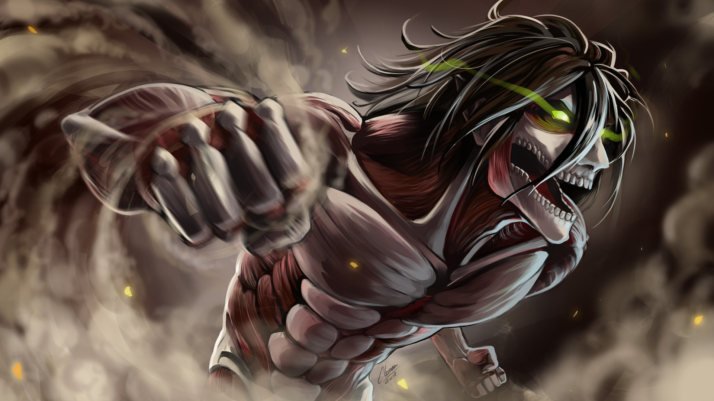
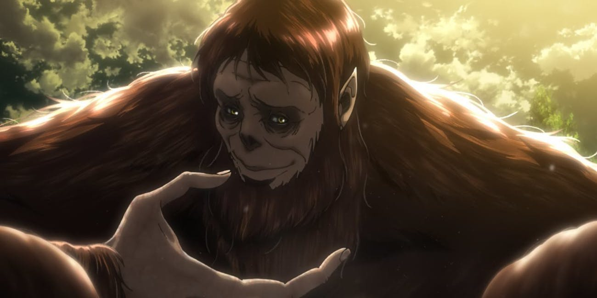
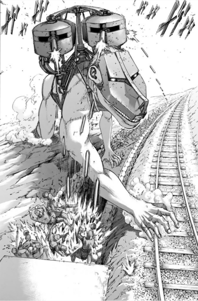

# Project Overview
In this project I used the keras deep learning library and with convolutional neural network created from scratch to do multi-classification on a custom Attack On Titan deep learning image dataset that I created scraping images from the web with python

# Classes

# 1) Armored Titan

# 2) Attack Titan

# 3) Beast Titan

# 4) Cart Titan

# 5) Colossal Titan

# 6) Female Titan

# My Deep Learning Blog!

https://medium.com/@TerranceWhitehurst
